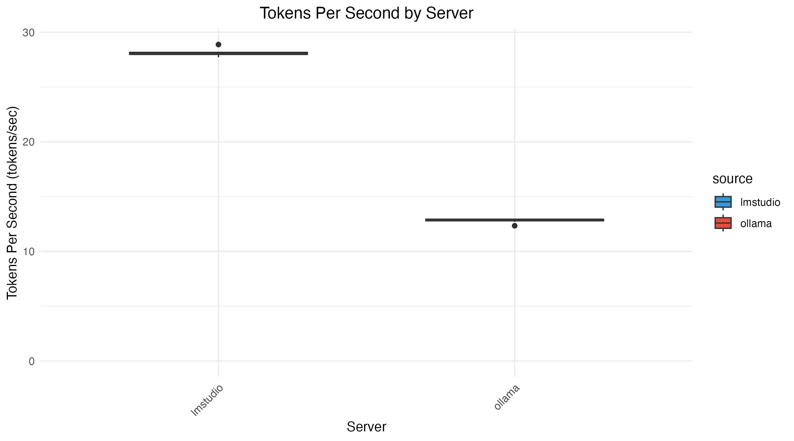

# LLM Benchmark Comparison

This project benchmarks and compares the performance of different LLM serving servers.

## Overview

The benchmark measures **tokens per second** (throughput) for different LLM serving configurations.

## Results

### Tokens Per Second by Server



## Key Findings

- **lmstudio** shows higher tokens per second compared to **ollama**
- The box plot displays the distribution of throughput across different models for each server

## Data Sources

- `data/lmstudio_llm_bench.csv` - lmstudio benchmark results
- `data/ollama_llm_bench.csv` - ollama benchmark results

## Scripts

- `scripts/merge_and_plot.R` - R script for merging datasets and generating the box plot
- `scripts/llm_bench.sh` - Shell script for running benchmarks
- `scripts/llm_test_ollama_vs_lmstudio.sh` - Test script for running benchark N times

## Plot Details

The box plot shows:
- **X-axis**: Server (lmstudio, ollama)
- **Y-axis**: Tokens Per Second (tokens/sec)

Each box represents the distribution of tokens per second for a given server, with:
- The thick horizontal line indicating the median
- The whiskers showing the range of values
- Any outliers marked as individual points

## Usage

Run the benchmark script to generate results:

```bash
cd scripts/
./llm_test_ollama_vs_lmstudio.sh
```

Generate the comparison plot:

```bash
cd ../
Rscript scripts/merge_and_plot.R
```