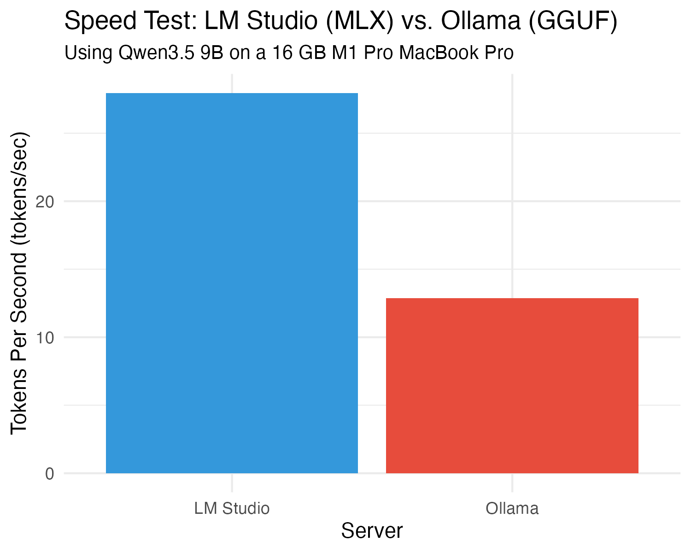
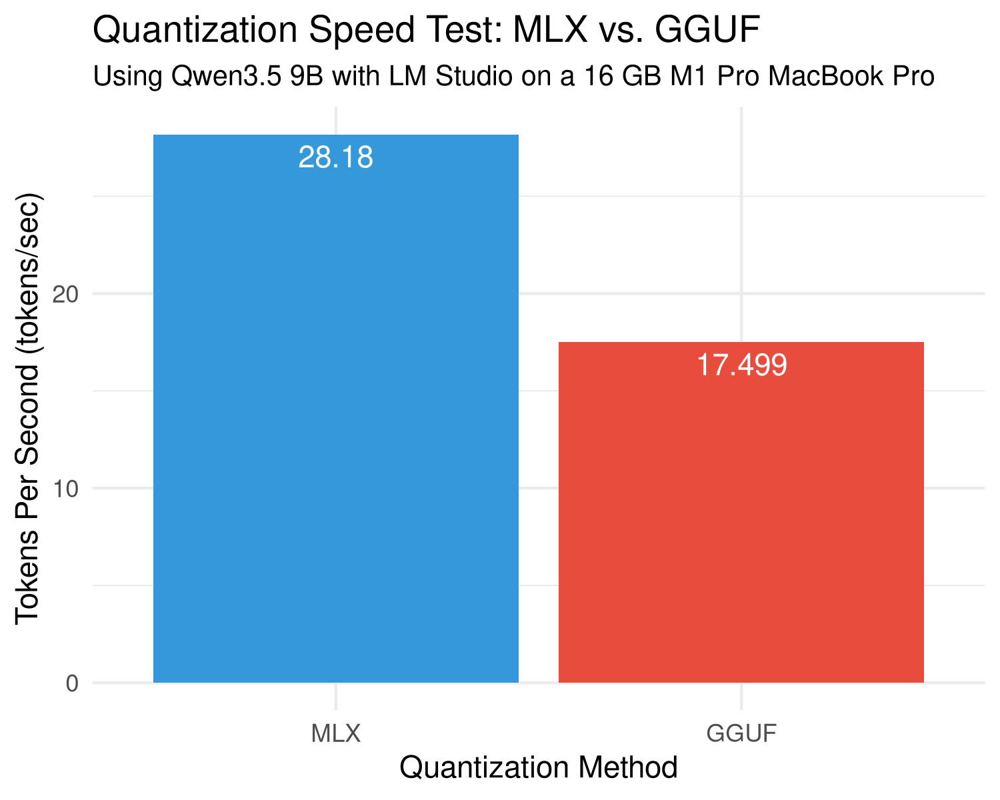
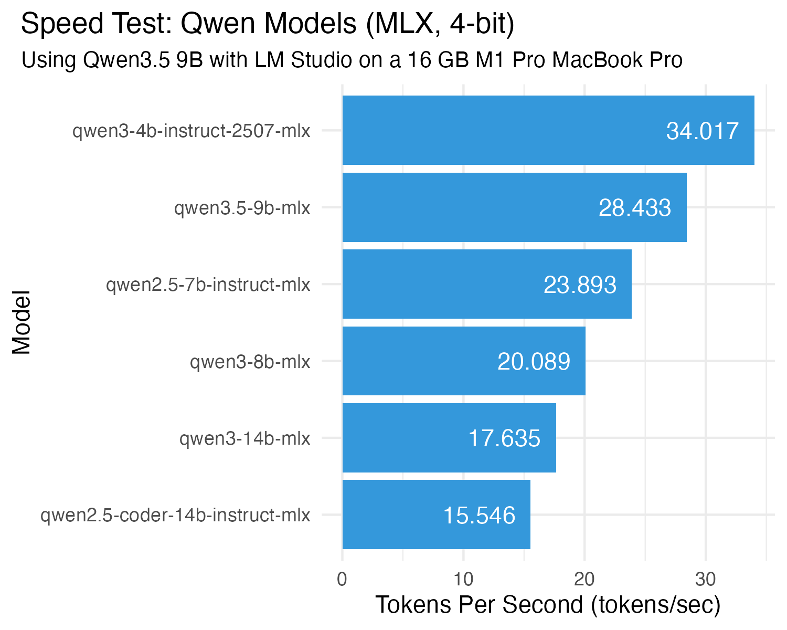

# LLM Benchmark Comparison

This project benchmarks and compares the performance of different LLM servers and quantization methods.

## Overview

The benchmark measures **tokens per second** (throughput) for different LLM serving configurations.

## Results

### Tokens Per Second by Server



### Tokens Per Second by Quantization Method



### Tokens Per Second by Qwen Model



## Key Findings

- **lmstudio** (MLX) shows ~2.2x higher tokens per second compared to **ollama** (GGUF)
- **qwen3.5-9b-mlx** shows ~1.6x higher tokens per second compared to **qwen3.5-9b-gguf** (both served by LM Studio)
- Qwen models (4-bit, MLX, 4B to 14B) ranged in speed from 15.5 to 34.0 tokens per second 

## Data Sources

- `data/lmstudio_llm_bench.csv` - lmstudio benchmark results
- `data/ollama_llm_bench.csv` - ollama benchmark results
- `data/qwen35-9b-mlx_llm_bench.csv` - MLX benchmark results
- `data/qwen35-9b-gguf_llm_bench.csv` - GGUF benchmark results
- `data/qwen*-4bit_llm_bench.csv` - Qwen 4bit MLX benchmark results

## Scripts

- `scripts/merge_and_plot.R` - R script for merging datasets and generating the bar plots
- `scripts/llm_bench.sh` - Shell script for running benchmarks
- `scripts/llm_test_ollama_vs_lmstudio.sh` - Test script for running server benchmark
- `scripts/llm_test_mlx_vs_gguf.sh` - Test script for running quant. benchmark
- `scripts/llm_test_qwen-series_mlx.sh` - Test script for running qwen benchmark

## Usage

Run the benchmark script to generate results:

```bash
cd scripts/
./llm_test_ollama_vs_lmstudio.sh
./llm_test_qwen35-9B_mlx_vs_gguf.sh
```

Generate the comparison plot:

```bash
cd ../
Rscript scripts/merge_and_plot.R
```
